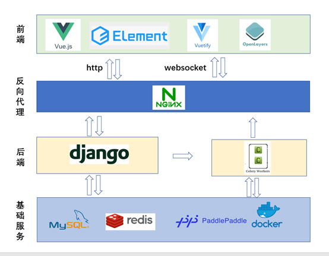
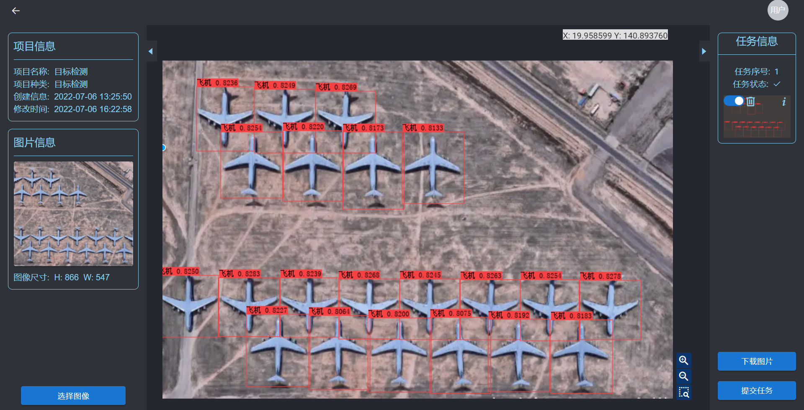
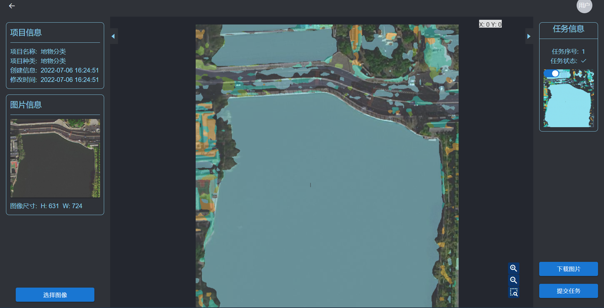
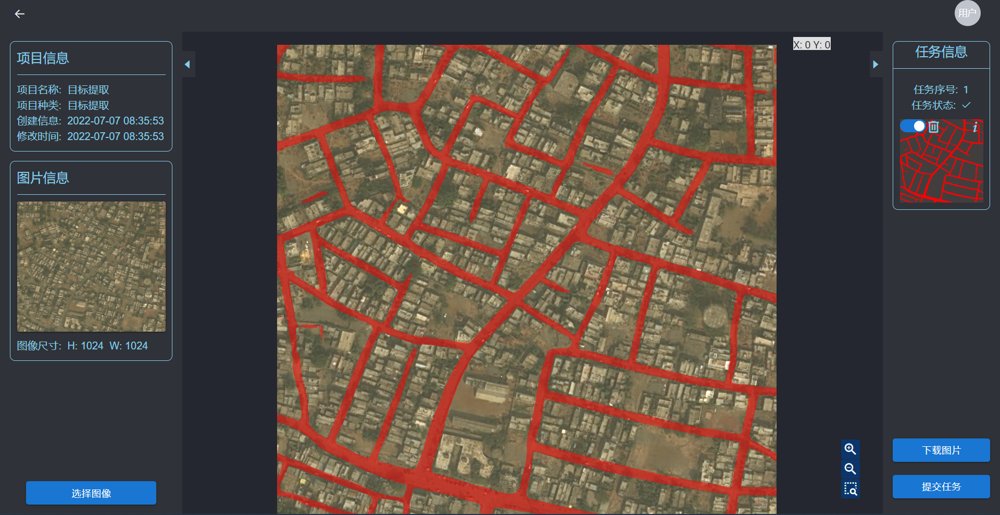
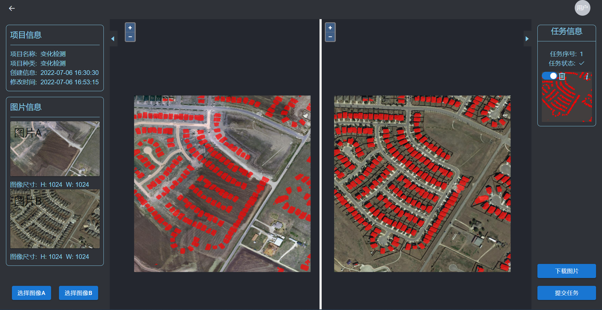
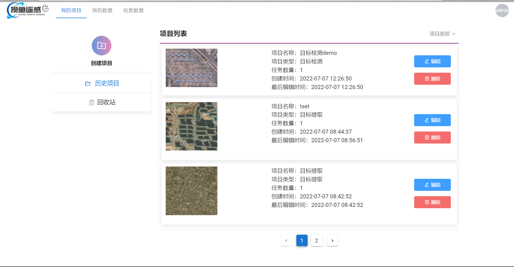
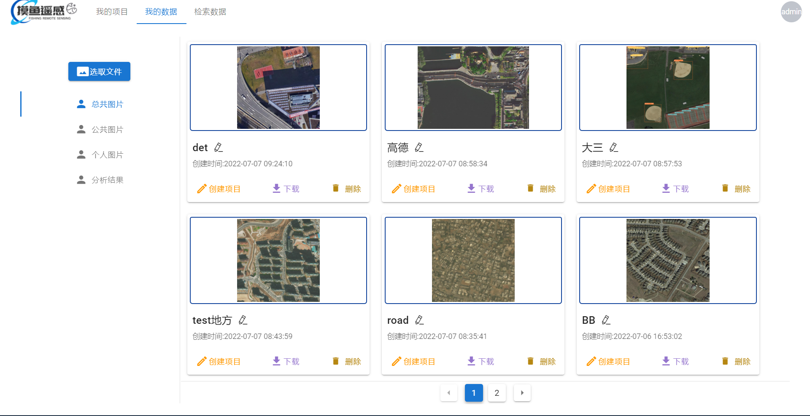

# 摸鱼遥感平台

这个参加第十一届 “中国软件杯”大学生软件设计大赛遥感解译赛道的前后端源码。由来自北京航空航天大学的(Hao Wen,XiaoDong Ji,XiangPeng Hu,XinTong Zhou)四人团队完成。


## 功能简介

### 用户功能

**用户登录**: 用户登录

**用户注册**: 用户注册

### 图片功能

**图片上传**: 支持用户上传自己的数据图片, 格式为`.png, .jpg`等图片格式。

**图片下载**: 支持用户下载自己的结果图片

**图片查看**: 支持用户查看自己的所有图片

**图片查询**: 支持通过经纬度等信息搜索对应地区遥感地图(数据来源高德地图), 并且可以将感兴趣区域添加到数据集。

### 数据分析

#### 目标检测

目标检测的训练数据集为[DOTA1.5](https://captain-whu.github.io/DOAI2019/), DOTA-v1.5数据集一共有16个类别，包含40万个带注释的对象实例。我们使用[PaddleDetection](https://github.com/PaddlePaddle/PaddleDetection)框架下的轻量级系列模型`PP-PicoDet`模型训练了50轮, 最终在验证集上的mAP达到了0.6483。

#### 地物分类

目标提取的训练数据集为WHDLD数据集,数据集中包含4940张遥感影像及对应地物分类标记样本，影像大小为256x256像素，影像以jpg格式存储，标签数据格式为单通道的png图像,数据覆盖包括6类地貌：裸地、建筑物、人行道、道路、植被、水域。我们使用了[PaddleSeg](https://github.com/PaddlePaddle/PaddleSeg)的`STDC1`网络最终在验证集上达到了68.10%的mIOU。

#### 变化检测

变化检测的训练数据集为[LEVIR-CD](https://justchenhao.github.io/LEVIR/), LEVIR-CD是一种新型的大规模遥感建筑物变化检测数据集。由637个超高分辨率（VHR，0.5m/像素）谷歌地球（GE）图像补丁对组成，大小为1024×1024像素。我们使用了[PaddleSeg](https://github.com/PaddlePaddle/PaddleSeg)下的`hrnet18`进行了训练, 最终在验证集上达到了`F1 = 0.8975`。

#### 目标提取


目标提取的训练数据集为 [DeepGlobe Road Dataset](https://competitions.codalab.org/competitions/18467#participate-get_starting_kit)。 在CVPR2018上, DeepGlobe Road Extraction Challenge提出了从卫星图像中自动提取道路和街道网络的挑战。我们使用了[PaddleSeg](https://github.com/PaddlePaddle/PaddleSeg)的`STDC1`网络,使用的训练项目为AIStudio项目[PP-LiteSeg模型应用案例——遥感道路分割](https://aistudio.baidu.com/aistudio/projectdetail/3873145?channelType=0&channel=0), 能在测试集达到83.08%的mIOU。

### 使用技术



#### 前端

[前端仓库地址](https://github.com/Costwen/rs-platform-frontend.git)

前端使用`Vue`框架, 在UI组件库方面使用了[ElementUI](https://element.eleme.io/#/zh-CN/component/installation)以及[Vuetify](https://element.eleme.io/#/zh-CN/component/installation)。地图显示以及项目之中图像显示部分使用了[openlayers](https://openlayers.org/)。前后端通信方面使用`http`和`websocket`。

#### 后端

[后端仓库地址](https://github.com/Costwen/rs-platform-backend.git)

收到前端的请求之后, `nginx`, 根据请求的内容转发给不同进程处理。

后端的服务端框架使用了`Django`, 基于`rest-framework`作为框架进行开发,  同时使用了`MySQL`做为数据库。

当收到前端对于图片分析的请求之后, 通过`Celery`以`Redis`作为消息队列进行异步处理任务。

当任务处理完毕之后使用`websocket`与前端进行通信告知任务完成。

为了方便部署, 后端部分均使用`docker`。

#### 模型部署

模型部署方面使用了[PaddleInference](https://www.paddlepaddle.org.cn/paddle/paddleinference), 在`Celery`启动时将模型直接加载入内存之中, 节约了每次调用都重新加载模型的时间。

同时由于变化检测模型推理速度较为慢, 可以使用[PaddleSlim](https://github.com/PaddlePaddle/PaddleSlim)将模型进行了`int8`量化, 推理花费的时间将减少了`1/3`(但是实际效果变差)。

### 推理效果展示图

#### 目标检测




#### 地物分类




#### 道路提取



#### 变化检测




### 界面展示图

#### 个人主页




#### 个人数据页



### 一些问题

**如何在自己的主机运行该项目?**

1. 使用`npm run build`编译好前端文件为`dist`

2. 在后端仓库的`deployment`文件夹下运行

```bash
docker-compose build
docker-compose up
```

并且将前面编译的`dist`文件夹放置在`deployment/compose/nginx`目录下即可。

如果出现前端无法连接到后端的情况, 请修改前端`vue.config.js`之中的`devServer`配置项, 将`host`配置为自己主机的即可。

如果出现后端无法连接`redis`的情况, 请修改`backend/settings.py`之中的`REDIS_HOST`配置项, 将`host`配置为自己主机的即可。

具体可以参照`doc`目录下面的部署文档

**模型文件**

模型文件在后端仓库的`params`文件夹下面。 在实际运行之中需要将其复制到`backend/params`目录(默认该目录不存在)下即可。


